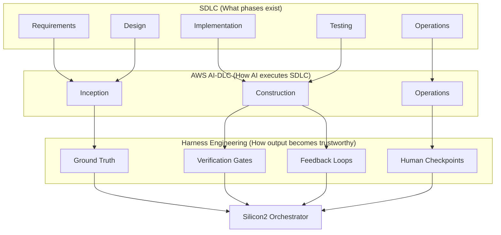

# Silicon2 Migration Orchestrator — 이론적 기반 및 서비스 포지셔닝

> 본 문서는 Silicon2 Migration Orchestrator가 **무엇을 하는 도구**인지가 아니라, **왜 SDLC·AI-DLC·Harness Engineering의 교차점에 서 있는지**를 이론적으로 정당화한다.  
> 구현 상세는 [architecture.md](./architecture.md)를, 실행 백로그는 [backlog.md](./backlog.md)를 참조한다.

---

## 1. 서론: “AI 코딩”과 “AI 엔지니어링”의 차이

2024년 이후 생성형 AI는 코드 작성 속도를 획기적으로 높였다. 그러나 **AI-assisted development**(코드 완성, 채팅 기반 리팩터링)와 **AI-autonomous development**(프롬프트 한 번에 앱 생성) 모두, 대규模·장기·규제 가능한 소프트웨어 공학 맥락에서는 한계가 드러났다.

| 접근 | 한계 |
|------|------|
| AI-assisted | 기존 SDLC ritual(회의, 계획, 수동 리뷰) 위에 AI를 얹을 뿐 — **구조적 비효율이 그대로** |
| AI-autonomous | 검증·추적·인간 판단 지점 없음 — **품질과 예측 가능성 붕괴** |

AWS는 이 간극을 **AI-Driven Development Life Cycle (AI-DLC)** 로 정의한다: AI를 중심 실행 주체로 두되, **인간 감독(Human Oversight)** 과 **아티팩트 추적(Traceability)** 을 SDLC 전체에 내재화하는 방법론이다.

Silicon2 Migration Orchestrator는 StyleKorean 관리자 시스템(1,099 PHP pages)을 React + Spring Boot로 이전하는 **도메인 특화 AI-DLC 실행 플랫폼**이다. 단순 LLM 래퍼가 아니라, 다음 세 층위를 동시에 구현한다:

```
┌─────────────────────────────────────────────────────────────┐
│  Harness Engineering   ← 검증·피드백·제약 (가장 바깥)        │
├─────────────────────────────────────────────────────────────┤
│  AI-DLC                ← Inception → Construction → Ops     │
├─────────────────────────────────────────────────────────────┤
│  SDLC                  ← 요구→설계→구현→테스트→배포 (재정의)   │
└─────────────────────────────────────────────────────────────┘
```

---

## 2. SDLC 관점: 레거시 마이그레이션 SDLC의 재정의

### 2.1 전통 SDLC와 레거시 마이그레이션의 구조적 실패

Waterfall·Agile 모두 **Greenfield(신규 개발)** 에 최적화되어 있다. Legacy migration SDLC는 본질적으로 다른 문제를 다룬다:

| Greenfield SDLC | Legacy Migration SDLC |
|-----------------|----------------------|
| 요구사항을 **정의**한다 | 요구사항이 **이미 코드에 묻혀** 있다 |
| 설계를 **선택**한다 | 설계를 **역추출**해야 한다 |
| “맞게 만들었는가?” | “**동일한가?**” (functional equivalence) |
| 단일 product backlog | 1,099개 독립 page + 상호 의존 |

StyleKorean `sk-main-php/adm`의 경우, 단순 산술로 1,099 pages × 2주 ≈ **42 person-years** — 전통 SDLC로는 조직적으로 지속 불가능하다.

### 2.2 본 서비스의 SDLC 재매핑

Orchestrator는 SDLC 단계를 **page 단위 bolt**(AI-DLC 용어: hours/days 단위 사이클)로 압축하고, 각 단계를 **기계적으로 검증 가능한 게이트**로 연결한다.

| SDLC Phase | 전통적 활동 | Orchestrator 구현 | 검증 게이트 |
|------------|------------|-------------------|------------|
| **Requirements** | 인터뷰, 문서화 | Step 1: `aispec.json` 로딩 (707개 pre-analyzed spec) | JSON schema, 필수 섹션 |
| **Analysis / Reverse Engineering** | 수동 코드 리딩 | Step 2: MCP `php_detect_gaps`, call graph | critical gaps == 0 |
| **Design** | API/아키텍처 회의 | Step 3: OpenAPI Contract 생성 | openapi-spec-validator |
| **Implementation (FE)** | React 개발 | Step 4: FSD + shadcn/ui 생성 (Claude CLI + worktree) | ESLint, TS parse, visual diff |
| **Implementation (BE)** | Spring Boot 개발 | Step 5: DDD/Hexagonal 생성 | `gradle compileJava` |
| **Testing** | QA, 단위/통합 테스트 | Step 6–8: JUnit, Contract, functional equivalence | `gradle test`, graph/SQL 비교 |
| **Deployment / Release** | CI/CD, 배포 | Step 9 + Git: branch, step별 commit, merge | artifact chain 무결성 |
| **Maintenance / Learning** | retrospective | Pattern Library, preference 학습 | confidence ≥ threshold |

**핵심 SDLC 혁신**: 요구사항 단계에서 LLM이 “추측”하지 않는다. 707개 `aispec.json`(평균 review score 0.896)이 **Requirements-as-Code** 로 기능한다. 이는 GitHub Spec Kit의 *spec-as-source* 티어와 동일한 철학이다 — **의도(intent)와 구현(implementation)의 분리**가 아니라 **의도의 사전 구조화**다.

### 2.3 SDLC 품질 속성과의 정렬

| ISO/IEC 25010 품질 속성 | Orchestrator 대응 |
|------------------------|-------------------|
| **Functional suitability** | Step 8: PHP trace ↔ Java Repository 비교 |
| **Compatibility** | Step 3: OpenAPI Contract — FE/BE 단일 진실 공급원 |
| **Maintainability** | FSD, DDD/Hexagonal, Pattern Library |
| **Portability** | Spec-driven — stack 변경 시 step만 교체 |
| **Reliability** | 3-Tier Self-Correction, retry with feedback |

---

## 3. AWS AI-DLC 관점: 방법론의 실행 계층

### 3.1 AI-DLC 정의 (AWS, 2025)

[AWS AI-DLC](https://aws.amazon.com/blogs/devops/ai-driven-development-life-cycle/)는 두 축으로 정의된다:

1. **AI Powered Execution with Human Oversight** — AI가 계획·실행하고, **판단이 필요한 지점에서만** 인간에게 위임
2. **Dynamic Team Collaboration** — AI가 routine을 처리하면 팀은 Mob Elaboration / Mob Construction에 집중

AI-DLC는 기존 Agile 용어를 **bolt, Unit of Work** 등으로 재정의하며, “weeks → hours/days” 속도 전환을 목표로 한다.

### 3.2 AI-DLC 3-Phase → Orchestrator 매핑

```
┌──────────────────────────────────────────────────────────────────────────┐
│ INCEPTION (WHAT & WHY)                                                    │
│  Workspace Detection → Reverse Engineering → Requirements → Stories       │
│  → Workflow Planning → Application Design                                 │
├──────────────────────────────────────────────────────────────────────────┤
│ Orchestrator: Step 1–3                                                    │
│  aispec 로딩 → MCP gap 검증 → OpenAPI Contract                          │
│  Human checkpoint: Step 2 gap / Step 3 contract review (선택)             │
└──────────────────────────────────────────────────────────────────────────┘
                                    │
                                    ▼
┌──────────────────────────────────────────────────────────────────────────┐
│ CONSTRUCTION (HOW)                                                        │
│  Functional Design → NFR → Infrastructure → Code Gen → Build & Test       │
├──────────────────────────────────────────────────────────────────────────┤
│ Orchestrator: Step 4–8                                                    │
│  React/Java 생성 → compile/lint → JUnit → integration → equivalence     │
│  Human checkpoint: Step 4/5 REVIEW_NEEDED, Tier 3 escalation            │
└──────────────────────────────────────────────────────────────────────────┘
                                    │
                                    ▼
┌──────────────────────────────────────────────────────────────────────────┐
│ OPERATIONS (RUN)                                                          │
│  IaC, deployment, observability — team oversight                          │
├──────────────────────────────────────────────────────────────────────────┤
│ Orchestrator: Step 9 + Git merge + (향후) ECS/Aurora 이관                 │
│  Cost/token observability, Pattern Library 지속 학습                      │
└──────────────────────────────────────────────────────────────────────────┘
```

### 3.3 AI-DLC 핵심 원칙과 본 서비스의 정합성

| AI-DLC 원칙 ([awslabs/aidlc-workflows](https://github.com/awslabs/aidlc-workflows)) | 본 서비스 구현 |
|-------------------------------------------------------------------------------------|---------------|
| **Adaptive depth** — 프로젝트 복잡도에 따라 단계 깊이 조절 | 단순 page: Step 2 자동 통과 / 복잡 page: Opus upgrade, Layer 3 context |
| **Human oversight at checkpoints** | REVIEW_NEEDED, Review Queue, Tier 3 escalation |
| **End-to-end traceability** | spec → openapi → code → test → git commit artifact chain |
| **Persistent context across sessions** | Artifact Store (DB + filesystem), Pattern Library |
| **Workflow scaffolds** — Rules/Steering as execution layer | Step별 system prompt, conventions, specialist prompts |
| **Platform-agnostic artifacts** | JSON/YAML/code — IDE·모델 교체 가능 |

### 3.4 AI-DLC가 해결하는 “vibes-based” AI 코딩 문제

AI-DLC는 ad-hoc 프롬프팅(“vibes-based coding”)을 **구조화된 bolt + 검증 checkpoint**로 대체한다.  
Silicon2 Orchestrator는 이를 **707-page batch migration** 규모로 **운영 가능한 형태**로 구현한 사례다:

- **Inception을 이미 수행함**: PHP analyzer harness가 707개 spec을 사전 생성 — AI-DLC Inception phase의 대량 병렬 선행 작업
- **Construction을 page bolt로 반복**: 각 page = 하나의 Unit of Work
- **Operations context 축적**: Pattern Library가 bolt 간 학습을 전달

---

## 4. Harness Engineering 관점: 프로덕션급 AI 시스템의 외부 루프

### 4.1 Harness Engineering 정의

Harness Engineering는 **모델 바깥의 전체 시스템** — context, tools, constraints, verification, feedback — 을 설계하는 학문이다. 계층 구조는 다음과 같다:

```
Prompt Engineering  →  단일 호출 최적화
Context Engineering →  무엇을 모델에 넣을 것인가 (3-Layer Context)
Harness Engineering →  모델 출력을 어떻게 신뢰 가능한 SW로 변환할 것인가
```

OpenAI Codex 팀(2026)의 “100만 LOC, zero keystrokes” 사례에서 강조된 것은 모델 성능이 아니라 **harness**(제약, 피드백 루프, 검증 레이어)였다. MetaGPT(arXiv:2308.00352)는 **Executable Feedback** 제거 시 성능 -4.2~5.4%p 하락을 실험적으로 입증 — harness 없는 생성은 통계적으로 열화된다.

### 4.2 Harness의 4대 구성요소와 본 서비스

| Harness Component | 정의 | Silicon2 Orchestrator |
|-------------------|------|----------------------|
| **1. Ground Truth Input** | 모델이 추측하지 않도록 입력을 구조화 | 707× `aispec.json`, MCP 정적 분석 |
| **2. Mechanical Constraints** | 아키텍처·스타일을 기계적으로 강제 | FSD, DDD/Hexagonal, OpenAPI Contract, ESLint, Gradle |
| **3. Verification Gates** | 각 생성 단계 후 실행 기반 검증 | Step 2–8 gates (compile, test, visual diff, graph) |
| **4. Feedback Loop** | 실패 → 구조화된 에러 → 재생성 | 3-Tier Self-Correction (Silent → Notify → Human) |

### 4.3 “Spec + Harness” 이중 구조

Spec-Driven Development와 Harness Engineering는 **상호 보완** 관계다:

- **Spec (aispec.json, OpenAPI)**: *무엇을 원하는가* — intent의 구조화
- **Harness (MCP, compile, test, diff)**: *코드가 spec과 일치하는가* — intent의 enforcement

> “Specs without automated tests and type checks drift silently. The spec says what you want; the harness proves you got it.”  
> — Spec-Driven Development 실무 논의 (2025–2026)

Silicon2는 **Spec layer**(harness/specs, 707 files)와 **Execution harness layer**(orchestrator pipeline)를 **분리·연결**한 end-to-end 구조다. 이는 단일 repo 내 Spec Kit + CI harness 패턴의 **엔터프라이즈 migration scale** 확장이다.

### 4.4 Output Harness (출력 처리 계층)

LLM 출력은 텍스트이지 코드가 아니다. Harness Engineering의 Output Harness는:

```
Raw LLM Output → Extraction → Validation → Auto-fix → Persist → Git
```

본 서비스의 Step 4/5는 Claude CLI Worker가 내부 self-correction 루프를 수행하고, Orchestrator가 **외부 harness gate**(lint pass, compile pass, file existence)로 이중 검증한다 — **nested harness** 패턴.

### 4.5 php-analyzer MCP: Reverse-Engineering Harness

707개 spec 자체가 **PHP codebase에 대한 harness 산출물**이다:

| MCP Tool | Harness 역할 |
|----------|-------------|
| `php_detect_gaps` | Spec completeness gate |
| `php_trace_entry_tree` | Functional equivalence input |
| `php_find_sql_by_table` | Data layer equivalence |
| `php_extract_js_api_calls` | FE-BE contract alignment |

MCP는 LLM의 “코드를 읽는 능력”을 **결정론적 정적 분석**으로 대체 — hallucination surface를 축소한다.

---

## 5. 세 프레임워크의 수렴: 왜 이 서비스는 “강한 이론적 기반”을 갖는가

### 5.1 수렴 다이어그램



### 5.2 이론적 강점 요약 (Elevator Pitch)

Silicon2 Migration Orchestrator는:

1. **SDLC 관점**: Legacy migration을 page 단위 bolt로 분해하고, functional equivalence를 1급 품질 속성으로 다룬다.
2. **AI-DLC 관점**: Inception( spec ) → Construction( code + test ) → Operations( git + pattern ) 3-phase를 707-page scale로 operationalize한다. Human oversight는 Tier 3와 Review Queue에 내재화된다.
3. **Harness Engineering 관점**: aispec + MCP + OpenAPI + compile/test/diff의 **다층 verification harness**로 probabilistic LLM output을 deterministic artifact chain으로 변환한다.

**한 문장 포지셔닝**:

> *Spec-driven, harness-enforced, AI-DLC-aligned migration orchestrator — 707 pages of legacy admin, one verified bolt at a time.*

### 5.3 경쟁 접근과의 이론적 차별

| 접근 | SDLC | AI-DLC | Harness | Scale |
|------|------|--------|---------|-------|
| 수동 마이그레이션 | ✓ (full) | ✗ | ✓ (manual) | ✗ |
| Copilot/Chat 코딩 | partial | ✗ | ✗ | ✗ |
| 일괄 LLM 변환 | ✗ | ✗ | ✗ | △ |
| AI-DLC rules only (aidlc-workflows) | ✓ | ✓ | partial | Greenfield |
| **Silicon2 Orchestrator** | **✓ (migration-specific)** | **✓ (executed)** | **✓ (multi-layer)** | **707 pages** |

---

## 6. 학술·업계 참조와 본 서비스 설계의 대응

| 출처 | 핵심 주장 | 본 서비스 대응 |
|------|----------|---------------|
| Anthropic, *Building Effective Agents* (2024.12) | Orchestrator-Worker > monolithic agent | 4종 Worker + Hub-and-Spoke |
| MetaGPT (arXiv:2308.00352) | Structured artifacts > natural language chaining | JSON spec, OpenAPI, typed schema |
| MetaGPT | Executable feedback +4.2~5.4%p | Step별 verification gates |
| AWS AI-DLC (2025) | AI execution + human oversight | 3-Tier escalation, Review Queue |
| AWS AI-DLC | End-to-end traceability | Artifact Store, step_executions, cost_log |
| Andrew Ng, Multi-Agent Patterns | Single-focus workers | Analysis/React/Java/MCP 분리 |
| Harness Engineering (2025–2026) | Verification converts output → deployable code | Output Harness, compile/lint/test |
| Spec-Driven Development / Spec Kit | Spec-as-source | aispec.json ground truth |

---

## 7. 결론

Silicon2 Migration Orchestrator는 “LLM으로 PHP를 Java로 바꾸는 스크립트”가 아니다.  
**SDLC의 migration-specific 재정의**, **AWS AI-DLC의 실행 인스턴스**, **Harness Engineering의 다층 검증 구현**이 교차하는 지점에 있다.

이론적 기반이 강한 이유는 단일 논문이나 블로그 포스트를 인용했기 때문이 아니라, **서로 다른 프레임워크가 독립적으로 도달한 동일한 결론** — *구조화된 intent, 단계별 verification, 인간 checkpoint, artifact traceability* — 을 **하나의 운영 시스템으로 통합**했기 때문이다.

707개 spec, php-analyzer MCP, review score — 이 **사전 harness 산출물**의 존재가 Greenfield AI-DLC와 근본적으로 다른 **Legacy migration AI-DLC** 라는 새 카테고리를 정당화한다.

---

## 참고 자료

1. AWS. [AI-Driven Development Life Cycle: Reimagining Software Engineering](https://aws.amazon.com/blogs/devops/ai-driven-development-life-cycle/). 2025.
2. AWS. [Open-Sourcing Adaptive Workflows for AI-DLC](https://aws.amazon.com/blogs/devops/open-sourcing-adaptive-workflows-for-ai-driven-development-life-cycle-ai-dlc/). 2025.
3. AWS Labs. [awslabs/aidlc-workflows](https://github.com/awslabs/aidlc-workflows). GitHub.
4. Anthropic. *Building Effective Agents*. 2024.12.
5. Hong, S. et al. *MetaGPT: Meta Programming for Multi-Agent Collaborative Framework*. arXiv:2308.00352.
6. Andrew Ng. *Agentic Design Patterns Part 5: Multi-Agent Collaboration*. DeepLearning.AI.
7. OpenAI Codex Team. Harness-driven autonomous development discourse. 2026.
8. GitHub. Spec Kit — Spec-Driven Development reference implementation.

---

*Related: [architecture.md](./architecture.md) · [backlog.md](./backlog.md)*
